# Pyronis EMR

A FHIR-native Electronic Medical Records UI built with **Next.js 16** and **React 19**. It connects directly to a FHIR R4B server (tested against [fhir-candle](https://github.com/GinoCanessa/fhir-candle)) with no proprietary backend — all clinical operations go through standard FHIR REST APIs.

> **Status:** Active development — core clinical workflows are implemented and usable. See the [feature gap analysis](MISSING_FEATURES.md) for what is planned next.

---

## Screenshots

### Login & Dashboard

<table>
<tr>
<td>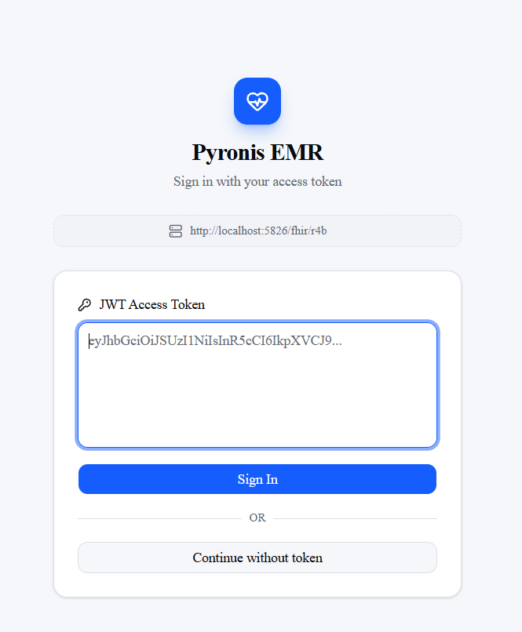</td>
<td>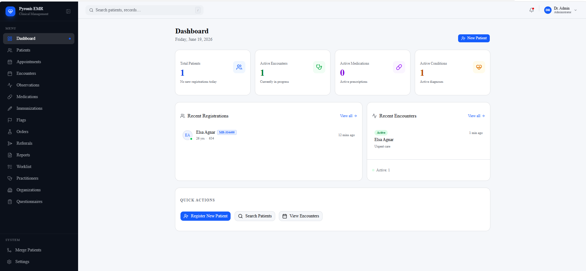</td>
</tr>
<tr>
<td align="center"><em>JWT login — or continue without a token against an open server</em></td>
<td align="center"><em>Dashboard — stat cards, recent registrations and encounters</em></td>
</tr>
</table>

### Patient Record

<table>
<tr>
<td>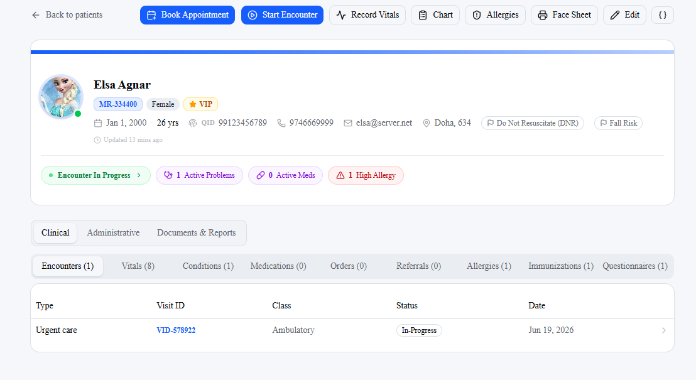</td>
<td>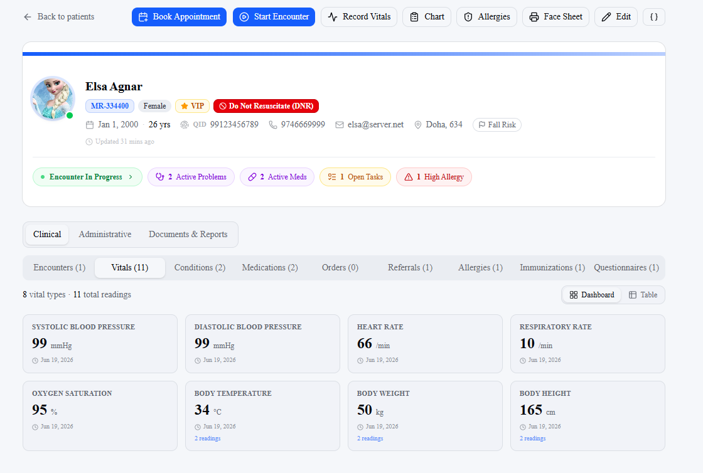</td>
</tr>
<tr>
<td align="center"><em>Patient header with clinical signal chips and tabbed clinical data</em></td>
<td align="center"><em>Vitals tab — latest readings for all 8 vital types</em></td>
</tr>
</table>

<table>
<tr>
<td>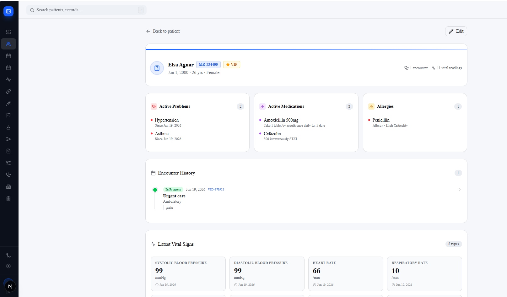</td>
<td>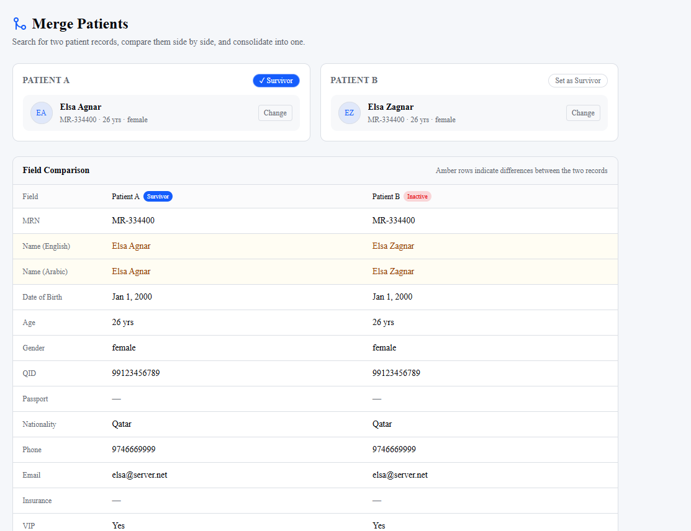</td>
</tr>
<tr>
<td align="center"><em>Chart summary — active problems, medications, allergies and encounter history</em></td>
<td align="center"><em>Patient merge — side-by-side field comparison, amber rows highlight differences</em></td>
</tr>
</table>

### Encounter

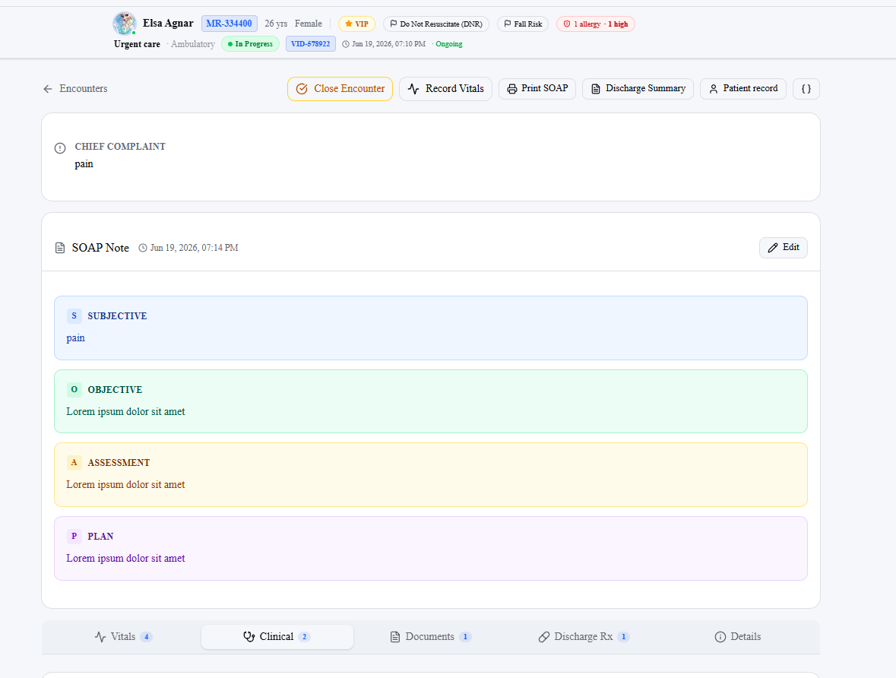

*Encounter detail — patient context bar, SOAP note (S/O/A/P), and tabbed clinical sections (Vitals, Clinical, Documents, Discharge Rx)*

### Clinical Tools

<table>
<tr>
<td>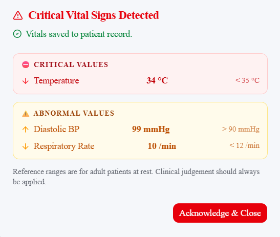</td>
<td>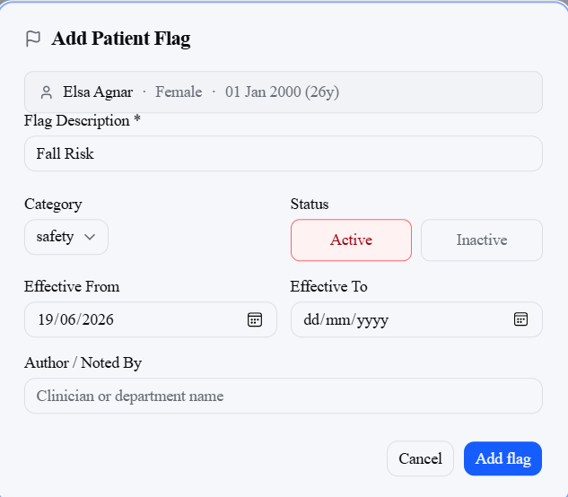</td>
</tr>
<tr>
<td align="center"><em>Critical vital sign alert — critical values in red, abnormal in amber</em></td>
<td align="center"><em>Add patient flag — category, status and effective date</em></td>
</tr>
</table>

<table>
<tr>
<td>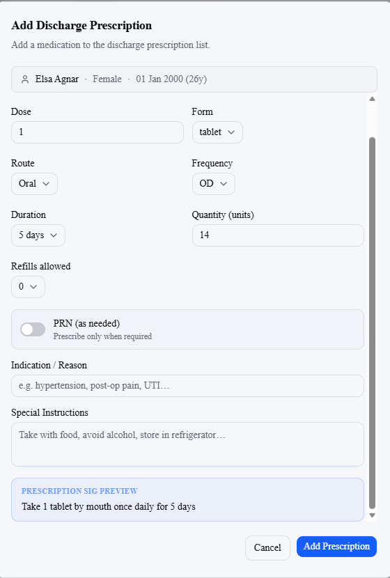</td>
<td>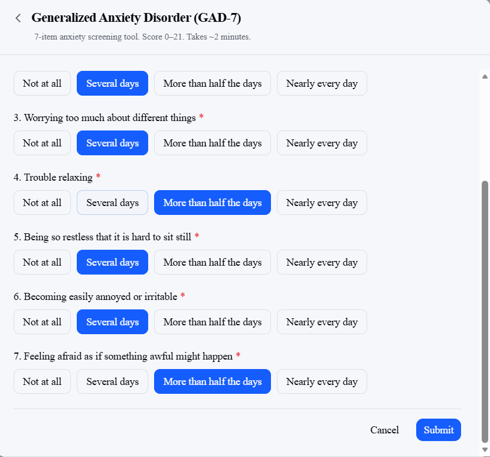</td>
</tr>
<tr>
<td align="center"><em>Discharge prescription builder — dose, route, frequency, duration with live sig preview</em></td>
<td align="center"><em>GAD-7 questionnaire — button-group answers, auto-scored on submit</em></td>
</tr>
</table>

### Medication Administration Record (MAR)

<table>
<tr>
<td>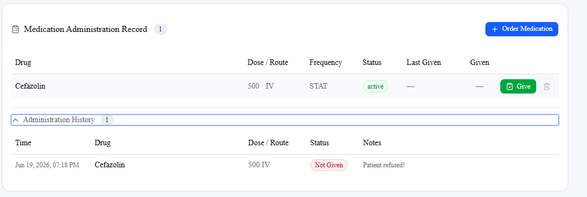</td>
<td>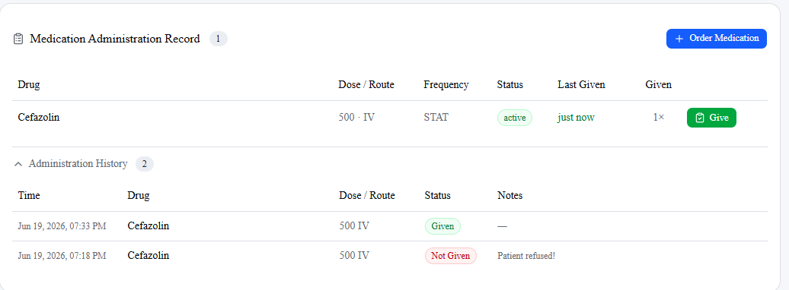</td>
</tr>
<tr>
<td align="center"><em>MAR — order active, first dose refused by patient</em></td>
<td align="center"><em>MAR — second dose recorded as given, full administration history</em></td>
</tr>
</table>

### Worklist & Directory

<table>
<tr>
<td>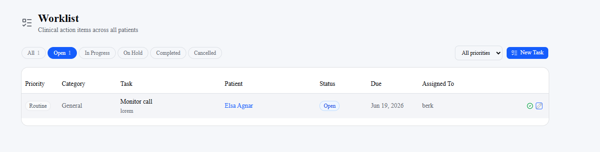</td>
<td>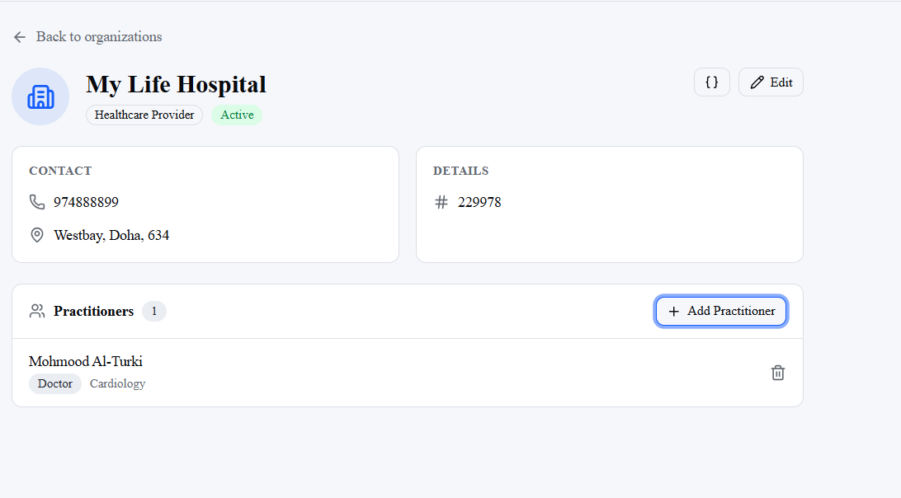</td>
</tr>
<tr>
<td align="center"><em>Global worklist — filter by status and priority across all patients</em></td>
<td align="center"><em>Organisation detail with linked practitioners</em></td>
</tr>
</table>

<table>
<tr>
<td>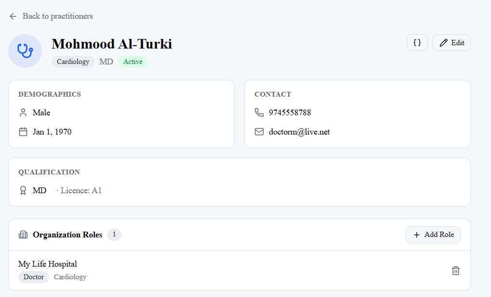</td>
<td>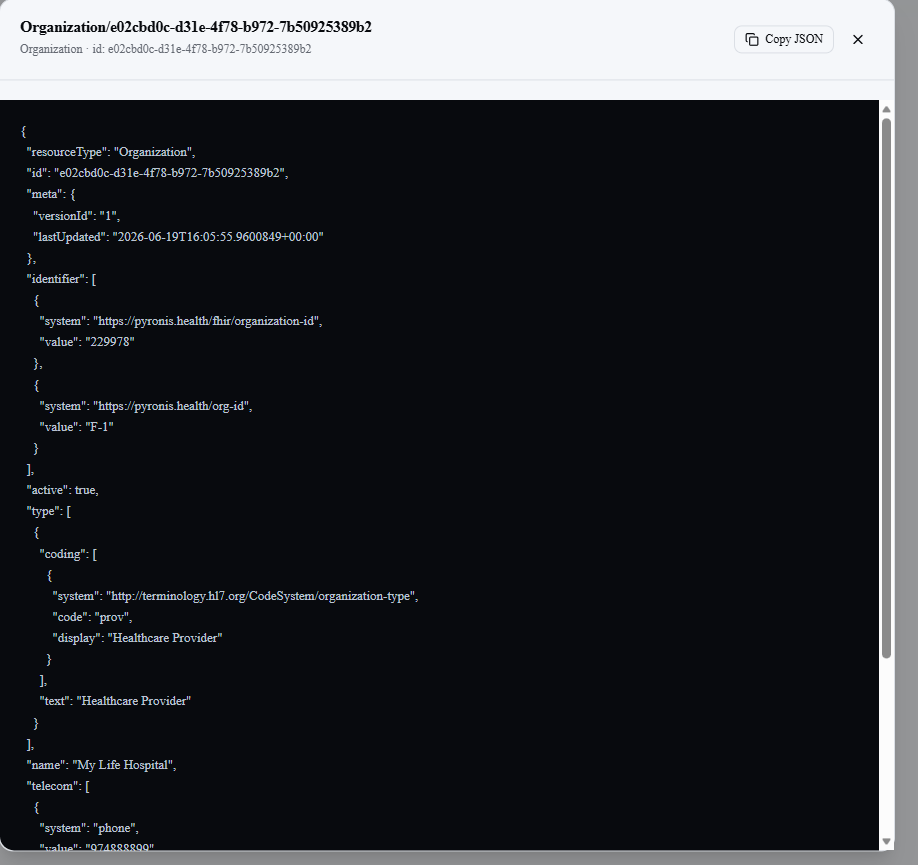</td>
</tr>
<tr>
<td align="center"><em>Practitioner detail — qualifications and organisation roles</em></td>
<td align="center"><em>Raw FHIR JSON viewer — available on every resource detail page</em></td>
</tr>
</table>

### Print

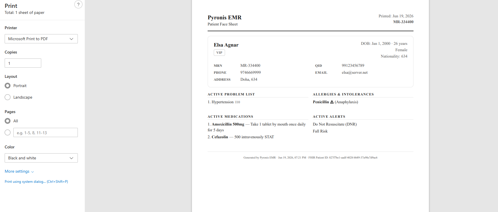

*Patient face sheet — print-ready layout with demographics, problem list, allergies, medications and active alerts*

---

## Features

### Patient Management
- Full demographic CRUD — English + Arabic bilingual names, photo (webcam or upload), MRN, QID, passport
- Rich demographics — nationality, ethnicity, person type, birth place, insurance, VIP flag, cadaveric donor, deceased status
- EMPI / QID deduplication on registration
- Patient chart summary — active problems, medications, allergies, vitals, encounter history
- Print-ready face sheet

### Clinical Workflows
- **Appointments** — book, reschedule, cancel, check-in, fulfil; month/week/day calendar view
- **Encounters** — start, close, SOAP notes (rich text, printable), discharge summary
- **Vitals / Observations** — batch entry, LOINC-coded, per-encounter and per-patient views
- **Problem List** — active / resolved conditions, ICD-10, promote encounter-diagnosis to problem list
- **Medications** — discharge Rx with dosage builder (printable); inpatient MAR with administration recording
- **Orders** — lab, radiology, procedure; priority, indication, cancel
- **Procedures** — order and record performed procedures
- **Immunizations** — CVX codes, lot, site, route, dose number, series
- **Allergies & Intolerances** — substance, criticality, reaction severity
- **Flags / Alerts** — categories, colour-coded, displayed on patient header
- **Diagnostic Reports** — LAB/RAD/PATH/REF/GEN with file attachments
- **Referrals** — create, edit, status tracking, per-encounter card, global list
- **Family History** — relationships, conditions, deceased status
- **Related Persons** — next of kin, emergency contacts, guarantors
- **Advance Directives** — DNR/DNI/POLST displayed on patient header
- **Questionnaires** — PHQ-9, GAD-7, AUDIT-C, Patient Intake; auto-scoring with severity labels
- **Tasks / Worklist** — 6 categories, priority, due date, assignee; global and per-patient views
- **Document Management** — file upload, download, delete; 9 document types

### Directory & Admin
- **Practitioner directory** — CRUD, specialties, qualifications, role-to-organisation links
- **Organisation registry** — CRUD, hierarchy (`partOf`), linked practitioners
- **Settings** — FHIR server URL, eMPI URL configurable at runtime

### UI
- Dark-navy sidebar with collapsible icon-only mode (state persisted)
- Patient tab clustering — 16+ tabs grouped into Clinical / Administrative / Documents & Reports
- Clinical signal chips on patient header — active encounter, problems, medications, tasks, critical allergies
- Skeleton loading screens and failed-fetch banners for every route
- Raw FHIR JSON viewer on every resource detail page
- Unified `StatusPill` component across all resource types
- JWT token login with middleware-protected routes

---

## Stack

| Concern | Package | Version |
|---|---|---|
| Framework | `next` | 16.2.7 |
| React | `react` | 19.2.4 |
| UI components | `shadcn` (v4) | ^4.10.0 |
| UI primitives | `@base-ui/react` | ^1.5.0 |
| FHIR types | `@medplum/fhirtypes` | ^4.5.2 |
| FHIR utilities | `@medplum/core` | ^4.5.2 |
| Icons | `lucide-react` | ^1.17.0 |
| CSS | Tailwind v4 + `tw-animate-css` | ^4 |

---

## Prerequisites

- **Node.js** 20+ and npm
- A running **FHIR server** — [fhir-candle](https://github.com/GinoCanessa/fhir-candle) is the tested and recommended for testing purposes. 

Start a local fhir-candle as .Net tool:

```bash
dotnet tool install --global fhir-candle
fhir-candle -o
```

The FHIR R4B base URL will be `http://localhost:5826/fhir/r4b`.

fhir-candle also exposes R4 at `/r4` and R5 at `/r5` on the same port. The web UI (useful for inspecting stored resources) is available at `http://localhost:5826`.

---

## Getting Started

```bash
# 1. Clone the repo
git clone https://github.com/berkant-k/pyronis.git
cd pyronis

# 2. Install dependencies
npm install

# 3. Configure environment
cp .env.example .env.local
# Edit .env.local — at minimum set NEXT_PUBLIC_FHIR_BASE_URL

# 4. Start the development server
npm run dev
```

Open [http://localhost:3000](http://localhost:3000).

---

## Environment Variables

Create a `.env.local` file at the project root:

```env
NEXT_PUBLIC_FHIR_BASE_URL=http://localhost:5826/fhir/r4b
NEXT_PUBLIC_EMPI_BASE_URL=http://localhost:5826/fhir/r4b
```

| Variable | Description |
|---|---|
| `NEXT_PUBLIC_FHIR_BASE_URL` | FHIR R4B server base URL |
| `NEXT_PUBLIC_EMPI_BASE_URL` | eMPI server base URL (can also be overridden at runtime from the Settings page) |

Both variables are public (browser-read) because Pyronis talks to FHIR directly with no intermediary backend.

---

## Scripts

```bash
npm run dev        # development server with hot reload
npm run build      # production build
npm run start      # serve production build
npm run lint       # ESLint
npx tsc --noEmit   # TypeScript type check (no output = clean)
```

---

## Project Structure

```
src/
  app/                   Next.js App Router pages
    patients/            Patient list, detail, new, edit
    encounters/          Encounter detail with clinical tab sections
    appointments/        Appointment list + calendar
    practitioners/       Practitioner directory
    organizations/       Organisation registry
    questionnaires/      Questionnaire library
    tasks/               Global task worklist
    reports/ orders/ medications/ flags/ ...
  components/
    patients/            PatientForm, PatientSearch
    layout/              Sidebar, Header
    ui/                  Shared primitives (PatientBanner, StatusPill, RawFhirDialog, …)
    reports/ orders/ ... Feature-specific cards and dialogs
  lib/
    fhir-client.ts       All FHIR fetch/mutate operations and display helpers
    empi-client.ts       eMPI query helpers
    auth.ts              JWT token storage (localStorage + cookie)
    questionnaires.ts    Built-in questionnaire definitions
    config.json          Deployment-configurable values (identifier systems, extension URIs, code lists)
```

---

## Architecture Notes

- **No backend** — the UI calls the FHIR server directly via `fetch`. All operations go through `src/lib/fhir-client.ts`.
- **Server components** fetch data at request time (`page.tsx`). **Client components** (`"use client"`) handle state, forms, and event handlers.
- Patient photos are stored as `Patient.photo[0]` base64 data URIs on the FHIR resource.
- Bilingual names — Arabic name is a second `Patient.name` entry carrying the HL7 language extension (`valueCode: "ar"`).
- MRN generation uses `nanoid` `customAlphabet("0123456789", 10)` — CSPRNG, no server round-trip, collision-safe.
- All deployment-configurable values (identifier systems, extension URIs, code lists) live in `src/lib/config.json`.

---

## Qatar & GCC Regional Context

Pyronis was originally designed for the Gulf healthcare environment and aligns with Qatar Ministry of Public Health (MoPH) FHIR profiles. These customisations are active by default but all identifiers and extension URIs are declared in `src/lib/config.json` and can be overridden for other regions.

### Patient Identifiers

| Identifier | System | Notes |
|---|---|---|
| MRN | `https://pyronis.health/mrn` | 10-digit numeric, CSPRNG-generated |
| QID | `http://hl7.org/fhir/sid/nn` | Qatar National ID — 11-digit national number |
| Passport | `http://hl7.org/fhir/sid/ppn` | HL7 passport number |

QID lookup against an external eMPI server is built into the patient registration flow to detect existing records before a new patient is created.

### MoPH FHIR Profile Alignment

Extensions used on `Patient` resources use Pyronis StructureDefinition URIs (`https://fhir.pyronis.health/StructureDefinition/…`):
The config file should be updated according to MoPH's documents.

| Field | Extension |
|---|---|
| Nationality | `patient-nationality` |
| Person type | `PersonType` |
| Ethnicity | `Ethnicity` |
| Birth place country | `patient-birthPlace` |
| Cadaveric donor | `patient-cadavericDonor` |
| Bilingual name language | `NameLanguage` |
| Address zone / street / building / unit | `AddressZone`, `AddressStreetNumber`, `AddressBuildingNumber`, `AddressUnit` |

Country codes use the **Pyronis Nationality CodeSystem** (`https://fhir.pyronis.health/CodeSystem/Nationality`) — ISO 3166-1 numeric codes (e.g., `634` = Qatar, `682` = Saudi Arabia).

### Person Types

Patient residency status is captured using Qatar-aligned codes:

| Code | Display |
|---|---|
| `QAT` | Qatari Citizen |
| `GCC` | GCC National |
| `RES` | Resident |
| `VIS` | Visitor |
| `DIP` | Diplomat |
| `STD` | Student |

### Bilingual Arabic / English Support

- Each patient record stores two `Patient.name` entries: English (default) and Arabic.
- The Arabic name entry carries the `NameLanguage` extension (`valueCode: "ar"`) and renders right-to-left.
- All name input fields in the patient form have a dedicated RTL Arabic section.
- The patient header, banner, and print pages display both names when available.

### Country & Nationality Lists

Country dropdowns show Qatar first, then the five other GCC states, then the major expat nationalities present in Qatar (India, Pakistan, Nepal, Bangladesh, Philippines, Egypt, Jordan, Lebanon, …), then the rest of the world alphabetically.

### Adapting for Other Regions

To deploy outside the GCC, update `src/lib/config.json`:
- Replace `fhir.pyronis.health` extension and code system URIs with your jurisdiction's equivalents (or keep them as-is — they are Pyronis-owned URIs with no external dependency).
- Swap out the `personType` options list for locally meaningful residency/patient-class categories.
- Replace the `countryCode` code system with ISO 3166-1 alpha-2 if preferred.
- The country list order in `src/lib/countries.ts` can be reordered to put your local countries first.

---

## Contributing

Contributions are welcome. Please open an issue before starting a large feature so the approach can be discussed.

1. Fork the repository and create a branch (`feature/my-feature` or `fix/my-fix`).
2. Run `npx tsc --noEmit` and `npm run lint` before submitting — PRs will not be merged with type errors or ESLint warnings.
3. Keep commits focused. Reference the relevant section of [MISSING_FEATURES.md](MISSING_FEATURES.md) if you are implementing a gap item.
4. Open a pull request against `main`.

---

## License

MIT — see [LICENSE](LICENSE) for details.
